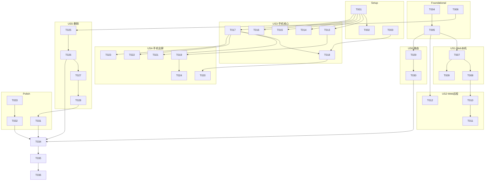

# Tasks: DSH Full Parity Completion — v2 官方 UI 复刻转向

**Input**: Design documents from `spec/dsh-full-parity/`（v2 spec.md + v2 plan.md，2026-09-20）
**Prerequisites**: plan.md (required), spec.md (required for user stories)

**Tests**: 未显式请求单元测试，不包含测试任务；验证阶段含构建+部署+UI 验证。

**Organization**: 任务按用户故事分组；US1/US2（Web 直载链）与 US3/US4（手机复刻链）在 Foundational 完成后可并行；US5 删除必须在 US1-US4 完成后执行；US6 路由终验最后。

## Format

任务行格式：`- [ ] [TaskID] [P?] [Story?] Description with exact file path`

- **[P]**: 可并行执行（不同文件，无依赖）
- **[Story]**: 所属用户故事
- 描述中包含精确文件路径与对照源码路径（`.research/deepseek-harness-mobile/` 为只读参照基准）

## Path Conventions

- Web 直载壳: `entry/src/main/ets/view/shell/WebShell.ets`
- 手机链组件: `entry/src/main/ets/view/`（对照源 `.research/deepseek-harness-mobile/app/src/main/java/com/labteto/dshmobile/`）
- Mobile token 层: `appstate/src/main/ets/ui/MobileTheme.ets`（对照 `ui/theme/*.kt`）
- 路由入口: `entry/src/main/ets/pages/Index.ets`
- 门禁: `tools/*.mjs`（用 `D:\nodejs\node.exe` 运行）

---

## Phase 1: Setup (Shared Infrastructure)

**Purpose**: MobileTheme token 层与形态判定，为手机复刻与路由提供共享基础

- [X] T001 移植 DSH Mobile 设计 token——对照 `.research/deepseek-harness-mobile/app/src/main/java/com/labteto/dshmobile/ui/theme/`（Color.kt/Shape.kt/Spacing.kt/Type.kt/Animation.kt）逐值移植为独立 token 层，含明/暗两套色板 in appstate/src/main/ets/ui/MobileTheme.ets
- [X] T002 [P] 更新 appstate 模块导出 MobileTheme 全部 token in appstate/src/main/ets/Index.ets
- [X] T003 [P] 扩展 LayoutController 输出路由形态判定（PHONE 含折叠闭合 / DESKTOP_LIKE 含平板、2in1、折叠展开）及形态变化通知 in appstate/src/main/ets/ui/LayoutController.ets

---

## Phase 2: Foundational (Blocking Prerequisites)

**Purpose**: WebShell 骨架、路由接线、删除清单——所有用户故事依赖此阶段

**⚠️ CRITICAL**: 用户故事工作不可在此阶段完成前开始

- [X] T004 实现 WebShell 组件骨架——Web 组件 + WebShellFacade 契约 + HostReadyState 状态机（BOOTING 等待页 / READY 时 loadUrl 加载 `http://127.0.0.1:3120` / FAILED、TIMEOUT 错误页含重试），WebviewController 私有持有，遵循现有 Facade 模式 in entry/src/main/ets/view/shell/WebShell.ets
- [X] T005 Index.ets 路由矩阵初接——按 T003 的 formFactor 条件渲染 WebShell（DESKTOP_LIKE）或 RemoteShell（PHONE），暂以形态为唯一维度 in entry/src/main/ets/pages/Index.ets
- [X] T006 PC 组件可达性分析——从 Index.ets 渲染树出发静态引用分析，产出「删除/保留」终裁清单（手机链可达即保留），写入 spec/dsh-full-parity/deletion-manifest.md（候选：AppShell/MainShell/MainHeaderShell/SidebarShell/RightbarShell/TrackResizer/DetailPane/PendingPane/DiagnosticsPane/WorkspacePane/TabContentView/CorePane/ShortcutKeys 等，以分析结果为准）

**Checkpoint**: WebShell 可加载官方 UI 骨架就绪，删除清单就绪，用户故事可并行开始

---

## Phase 3: User Story 1 - PC/平板官方 Web UI 直载（本机） (Priority: P1) 🎯 MVP

**Goal**: DESKTOP_LIKE 形态打开 App 即见与官方像素级一致的 Web UI，桌面语义完整，异常路径不白屏

**Independent Test**: 平板/2in1 模拟器启动 App，与官方 Web UI 同屏对比一致；对话/侧栏/轨迹/设置全部可用；杀掉 host 进程出现错误页可重试

### Implementation for User Story 1

- [X] T007 [US1] 验证明文 localhost 直载与桌面交互语义——键鼠/hover/右键/快捷键/文本选择在 Web 组件内完整透传；若明文 `http://127.0.0.1:3120` 被安全策略拦截则补本地回环明文放行配置 in entry/src/main/ets/view/shell/WebShell.ets + entry/src/main/module.json5
- [X] T008 [US1] 完善等待/错误态——host 启动进度文案与超时阈值、加载失败诊断信息（HTTP 状态/URL）、onErrorReceive 接线、重试/重载动作 in entry/src/main/ets/view/shell/WebShell.ets
- [X] T009 [US1] 响应式布局跟随——窗口 resize/横竖屏/分屏变化时官方 UI 重排正确，WebShell 不固定尺寸约束 in entry/src/main/ets/view/shell/WebShell.ets

**Checkpoint**: PC/平板本机 Web 直载完整可用

---

## Phase 4: User Story 2 - 远程模式 Web 直载（PC/平板） (Priority: P1)

**Goal**: 远程模式下 DESKTOP_LIKE 形态加载远程主机官方 Web UI，断连/认证失败有明确处理

**Independent Test**: PC 连接局域网内另一台 dsh host，官方 UI 完整可用；断网出现断连提示并自动重连

### Implementation for User Story 2

- [X] T010 [US2] WebShell 支持远程加载——从 HubSnapshot.activeRemoteHost 派生 remoteBaseUrl，hostReadyState 或 activeRemoteHost 变化时重载 in entry/src/main/ets/view/shell/WebShell.ets
- [X] T011 [P] [US2] 远程状态呈现——断连 DEGRADED 横幅在 WebShell 外层显示（Web 内容保留最后状态）；认证失败明确提示与重新输入入口 in entry/src/main/ets/view/shell/WebShell.ets + entry/src/main/ets/view/HubBanner.ets
- [X] T012 [P] [US2] ConnectPane 的 DESKTOP_LIKE 适配——远程入口（LAN 发现列表/手动 IP:Port）在 Web 路线下的连接页样式与流程收口 in entry/src/main/ets/view/ConnectPane.ets

**Checkpoint**: PC/平板双模式 Web 直载完整

---

## Phase 5: User Story 3 - 手机 DSH Mobile 复刻：核心对话流 (Priority: P1)

**Goal**: 手机形态核心屏与 DSH Mobile 源码逐屏对照一致——回合流、顶栏、输入区、工具卡、设计基元

**Independent Test**: 手机模拟器发起对话，各屏与 `.research/deepseek-harness-mobile` 对应源文件对照一致

### Implementation for User Story 3

- [X] T013 [US3] 回合流对照复刻——ChatTranscript.kt/ChatNodeItem.kt/ChatProjections.kt 的回合列表结构、流式输出、节点可见性规则 in entry/src/main/ets/view/ConversationPane.ets + MessageRow.ets + TurnView.ets
- [X] T014 [P] [US3] 顶栏对照复刻——ChatTopBar.kt 的布局、状态、返回/抽屉触发 in entry/src/main/ets/view/ConversationHeader.ets
- [X] T015 [P] [US3] 输入区对照复刻——Composer.kt/QuestionComposer.kt 的布局、发送态、附件入口、斜杠命令入口 in entry/src/main/ets/view/Composer.ets
- [X] T016 [P] [US3] 工具卡对照复刻——ToolCards.kt/ToolCardMapping.kt/ToolCardModels.kt 的卡片分类、样式、折叠交互 in entry/src/main/ets/view/ToolCard.ets
- [X] T017 [P] [US3] 设计基元移植——DsButton/DsCard/DsPill/DsSegmented/DsIconButton/DsBottomSheet/EmptyHero/SectionHeader/StateDot/Shimmer/ToggleRow/DisclosureRow/ContextMeter 对照 ui/components/ in entry/src/main/ets/view/NativePrimitives.ets
- [X] T018 [US3] 主屏范式对照——MainScreen.kt/AppRoot.kt 的整体结构与面板状态（PanelState.kt）映射到 RemoteShell 主区 in entry/src/main/ets/view/shell/RemoteShell.ets

**Checkpoint**: 手机核心对话流逐屏对照达标

---

## Phase 6: User Story 4 - 手机 DSH Mobile 复刻：抽屉、dock 与次级屏幕 (Priority: P2)

**Goal**: 边缘手势抽屉、队列/目标 dock、轨迹台账、Sheet 系列与次级屏幕全部对照复刻

**Independent Test**: 手势滑出抽屉、操作 dock、查看台账、打开各 Sheet，逐项与源码对照一致

### Implementation for User Story 4

- [X] T019 [US4] 左抽屉对照复刻——ChatListDrawer.kt 的手势滑出/跟手拖拽/关闭动画、会话列表布局（含 ArchivedSessions.kt 归档态） in entry/src/main/ets/view/DrawerNav.ets
- [X] T020 [US4] 右抽屉详情对照复刻——DetailsPanel.kt/WorkspacePanels.kt 的会话详情布局 in entry/src/main/ets/view/shell/RemoteShell.ets
- [X] T021 [P] [US4] dock 对照复刻——Docks.kt 的队列 dock（编辑/删除/重排）与目标 dock（阶段/轮次/暂停/恢复/编辑）in entry/src/main/ets/view/LatticeDock.ets
- [X] T022 [P] [US4] 轨迹台账对照复刻——TrajectoryTab.kt 的按回合步骤与用量统计布局 in entry/src/main/ets/view/TrajectoryInspector.ets + TimelineOverview.ets
- [X] T023 [P] [US4] Sheet 系列与搜索/反馈对照复刻——SheetCommands/SheetModels/SheetPermission/SheetPresets/SheetSubagents/SessionSearch/FeedbackDialog/SlashAdjudication 对照源码 in entry/src/main/ets/view/CommandList.ets + SessionModelPicker.ets + SettingsPresets.ets + SubagentCard.ets + SessionSearch.ets + MessageFeedback.ets
- [X] T024 [P] [US4] 连接/设置屏对照复刻——ConnectScreen.kt/ConnectDiagnosis.kt/SettingsScreen.kt 的布局与流程 in entry/src/main/ets/view/ConnectPane.ets + SettingsPane.ets

**Checkpoint**: 手机全量屏幕（TerminalPanel/PairScreen 延期除外）对照达标

---

## Phase 7: User Story 5 - 旧 PC 原生组件删除与工程收敛 (Priority: P2)

**Goal**: 按 deletion-manifest 执行删除，构建零死引用，门禁全绿

**Independent Test**: 删除后构建成功、门禁套件全部通过、手机链功能回归无损

**⚠️ 依赖**: 必须在 US1-US4 全部完成后执行（手机链引用关系确定后才可终裁）

### Implementation for User Story 5

- [X] T025 [US5] 删除第一批——PC 专用 shell 组件（以 deletion-manifest 为准：AppShell/MainShell/MainHeaderShell/SidebarShell/RightbarShell/TrackResizer 等）及 Index.ets 中对应装配代码 in entry/src/main/ets/view/shell/
- [X] T026 [US5] 删除第二批——PC 专用 pane 与工具组件（以 deletion-manifest 为准：DetailPane/PendingPane/DiagnosticsPane/WorkspacePane/TabContentView/CorePane/ShortcutKeys 等）及残余死引用清理 in entry/src/main/ets/view/
- [X] T027 [US5] token 与基线收敛——仅 PC 链消费的 HarmonyTheme token 清理，design-token baseline 棘轮收紧（裸值计数只降不升）in appstate/src/main/ets/ui/HarmonyTheme.ets + tools/design-token-baseline.json
- [X] T028 [US5] 门禁脚本同步——feature-wiring 锚点、parity 行状态、layout fixtures 对删除与新架构的适配 in tools/check-feature-wiring.mjs + tools/check-parity.mjs + tools/check-layout-fixtures.mjs

**Checkpoint**: 架构收敛完成，双链（Web/手机）无死代码

---

## Phase 8: User Story 6 - 形态与模式路由编排 (Priority: P3)

**Goal**: 四形态 × 两模式路由矩阵完整，折叠屏开合动态切换不丢状态

**Independent Test**: 折叠屏开合切换渲染路线正确且会话延续；远程模式下切换形态路由正确

### Implementation for User Story 6

- [X] T029 [US6] 折叠屏开合动态切换——LayoutController 形态变化事件驱动路由重算，Web↔原生互切时会话/草稿状态不丢失（状态全部住 SessionHub/AppStorage 的验证）in entry/src/main/ets/pages/Index.ets
- [X] T030 [US6] 路由矩阵终验与边缘态——模式切换跨形态（PC 本机→远程、手机本机→远程）组合下路由正确；remoteModePending 等守卫在双壳下行为一致 in entry/src/main/ets/pages/Index.ets

**Checkpoint**: 路由编排完整

---

## Phase 9: Polish & Cross-Cutting Concerns

- [X] T031 [P] 文档更新——docs/01 §1.1 对标口径、docs/04 UI 规范、docs/parity-matrix.md §4/§5/§6 改为「Web 直载 + DSH Mobile 源码对照复刻」新架构口径 in docs/01-产品与功能说明.md + docs/04-HarmonyOS多端UI设计规范.md + docs/parity-matrix.md
- [X] T032 [P] 运行全门禁套件——check-parity/check-design-tokens/check-feature-wiring/check-layout-fixtures/check-compliance（用 `D:\nodejs\node.exe` 运行）全绿 in tools/
- [X] T033 代码审查——手机链组件头注释标注对照源文件路径（契约要求）；无新增裸设计值；无 stub 残留 in entry/src/main/ets/

---

## Phase 10: Verification

<!-- verification_scope: build+ui -->

**Purpose**: 构建、部署与逐用户故事 UI 验证

- [ ] T034 Build project and fix any compilation errors (invoke build_project; iterate fix → build until success)
- [ ] T035 Deploy application to device/emulator (invoke start_app)
- [ ] T036 Run UI verification against deployed application (invoke verify_ui)——逐用户故事：US1 平板形态官方 UI 像素一致；US2 远程 Web 直载；US3/US4 手机屏对照 DSH Mobile；US5 删除后回归；US6 路由切换

---

## Dependencies & Execution Order

### Dependency Graph



**执行顺序硬约束**：
- US5 的 T025/T026 必须等 US1-US4 全部完成（T009/T011/T012/T019-T024）后才可执行
- 其余用户故事在 Foundational（T004-T006）完成后即可并行

---

## ⚡ Parallel Execution Guide

| Phase | Tasks | Required Files | Execution Notes |
|-------|-------|----------------|-----------------|
| Setup | T002, T003 | Index.ets(appstate), LayoutController.ets | 两个独立文件，与 T001 并行 |
| Foundational | T004→T005, T006 | WebShell.ets, Index.ets(entry), 分析 | WebShell 骨架与可达性分析可并行 |
| US1 | T008, T009 | WebShell.ets | 同文件串行，T007 先行 |
| US2 | T011, T012 | HubBanner.ets, ConnectPane.ets | 与 T010（WebShell）不同文件可并行 |
| US3 | T013, T014, T015, T016, T017 | ConversationPane/Header/Composer/ToolCard/NativePrimitives | 五个不同文件，完全并行（本特性最大并行批次） |
| US4 | T021, T022, T023 | LatticeDock/TrajectoryInspector/Sheet 系列 | 三个不同文件可并行；T019/T020/T024 串行收尾 |
| US5 | T025→T026→T027→T028 | shell/, view/, HarmonyTheme, tools | 严格串行（每步构建验证） |
| Polish | T031, T032 | docs/, tools/ | 文档与门禁可并行 |

---

## Parallel Example: User Story 3（本特性最大并行批次）

```text
# 前置：T001 MobileTheme 完成、T004-T006 Foundational 完成
# 五个不同文件，可同时派发五个并行任务：

Task T013: "回合流对照 ChatTranscript.kt in ConversationPane.ets + MessageRow.ets + TurnView.ets"
Task T014: "顶栏对照 ChatTopBar.kt in ConversationHeader.ets"
Task T015: "输入区对照 Composer.kt in Composer.ets"
Task T016: "工具卡对照 ToolCards.kt in ToolCard.ets"
Task T017: "设计基元对照 ui/components/ in NativePrimitives.ets"

# 然后串行收尾：
Task T018: "主屏范式对照 MainScreen.kt in RemoteShell.ets"（依赖 T003 + T017）
```

---

## Implementation Strategy

### 双链并行（推荐）

1. Setup + Foundational → WebShell 骨架 + 路由初接 + 删除清单
2. **链 A（Web 直载）**：US1→US2，一个代理顺序执行
3. **链 B（手机复刻）**：US3→US4，可再拆 2 个代理（核心屏批 + 次级屏批）
4. 汇合：US5 删除收敛（严格串行）→ US6 路由终验
5. Polish → Verification（build + UI）

### MVP

Setup + Foundational + US1 即为 MVP——PC/平板官方 UI 直载可用。

---

## Notes

- Web 组件 API 基线：WebviewController.loadUrl / onControllerAttached / onErrorReceive / refresh（已核实）
- 手机复刻唯一参照：`.research/deepseek-harness-mobile/app/src/main/java/com/labteto/dshmobile/`（只读，禁止修改）
- 延期项不复刻：TerminalPanel.kt（Terminal/PTY）、PairScreen.kt（relay 配对）
- 每个手机链组件实现须在头注释标注对照源文件路径（T033 审查项）
- 删除以 deletion-manifest.md 终裁，禁止盲删；每批删除后必须构建验证
- design-token baseline 棘轮只降不升；门禁用 `D:\nodejs\node.exe` 运行
- v1 遗留：`remoteModePending` 守卫等机制保留并在 T030 双壳下验证
