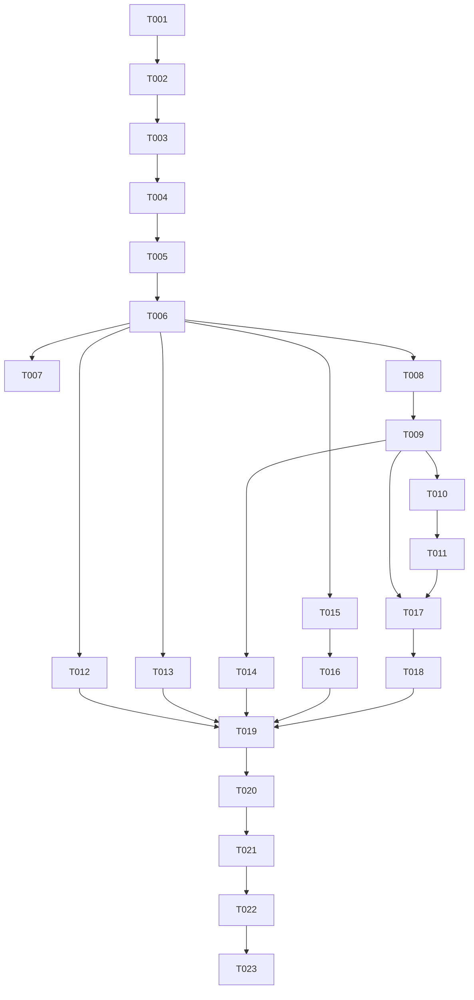

# Tasks: dsh 核心升级 0.1.6-alpha.2 —— 设置项核查与工作区工具能力修复（v3）

**Input**: Design documents from `spec/dsh-full-parity/`（spec.md v3 / plan.md v3）
**Prerequisites**: plan.md（已就绪）、spec.md（已就绪，5 用户故事）

**Tests**: 未按 TDD 要求逐任务建测试；既有单测/门禁随任务同步更新。

**Organization**: 按用户故事分组。基础阶段（配方→物化→补丁适配→打包）阻塞全部故事；故事阶段文件领地互不重叠，可并行派发。

## Format: `[ID] [P?] [Story] Description`

- **[P]**: 可并行（不同文件、无未完成依赖）
- **[Story]**: 所属用户故事
- 路径均为仓库根相对路径

## Path Conventions

- 单仓库多模块工程：`entry/`（应用）、`appstate/`+`dshcompat/`+`connection/`（协议与状态 HAR）、`hostruntime/`（端侧宿主 HAR）、`hostcore/`（打包配方与入口脚本源）、`tools/`（构建/门禁脚本）、`docs/`（文档）
- 产物路径：核心包 zip 落 `entry/src/main/resources/resfile/`（gitignore，不进版本库）；入口脚本放位产物 `entry/src/main/resources/resfile/resources/`（gitignore）
- 任务描述中的路径均为仓库根相对路径

---

## Phase 1: Setup（升级入口）

- [X] T001 更新核心配方：`coreVersion` → `0.1.6-alpha.2`；删除变体配方 `hostcore/core-recipe-rc3.json`（避免双真值源，历史在 git）；核对 overrides 三项（node-pty/koffi/sharp 的 ohos 供给别名）与 0.1.6-alpha.2 依赖声明的一致性，不一致先记下待 T002 实证，in hostcore/core-recipe.json

---

## Phase 2: Foundational（核心物化与补丁适配——阻塞所有故事）

**⚠️ CRITICAL**: 本阶段全部完成前不得开始任何用户故事。

- [X] T002 物化 0.1.6-alpha.2 核心树：npm install（--os=openharmony --cpu=arm64）钉 `@deepseek-ai/*@0.1.6-alpha.2`；处理依赖闭包漂移（koffi 版本要求变化则适配 tools/fetch-koffi.mjs 自建供给；sharp/libvips 供给 tools/collect-libvips.mjs 如需跟进），in tools/pack-core.mjs + hostcore/core-recipe.json
- [X] T003 核对新树上的裁剪规则与产物清单：prune 的 keepOnlyDirs/removeGlobs 路径是否仍存在（koffi/build/koffi、node-pty/prebuilds 等）、requiredNative 三项（koffi.node/pty.node/spawn-helper）在新版本布局下是否原样成立，失配即改配方，in hostcore/core-recipe.json
- [X] T004 六类补丁 + preset 逐锚点适配新源树（fail-loud：上游漂移即更新锚点与断言，绝不放宽为跳过）：Origin 栅栏列表、link 沙箱降级（patchLinkForSandbox）、凭据属主豁免（patchCredentialsOwnerCheck）、sharp 调度器（wrapSharp + assertSharpImplIsReal）、node-addon-system 平台包、linux_arm64 平台别名、addOnDevicePreset（preset 机制若在 0.1.6 变化则按新机制重生成），in tools/pack-core.mjs
- [X] T005 启动参数表实证复核：读新树 dsh-web-app 的 startup.js，核对 --port/--host/--no-open/--trusted-host 四项仍合法、无新增必填项；有变化则同步 hostcore/app/main.js 的 args 构造并写注释证据；改过 main.js 后重放 `node tools/place-host-app.mjs`，in hostcore/app/main.js + entry/src/main/resources/resfile/resources/
- [X] T006 打包全流程成功：`node tools/pack-core.mjs --place-in-app` 产出 dsh-core-0.1.6-alpha.2-openharmony-arm64.zip；从 entry/src/main/resources/resfile/ 移除 rc.2/rc.3 旧 zip（仅留 alpha.2）；树内元数据 hdsh-core.json 写读核对通过，in tools/pack-core.mjs + entry/src/main/resources/resfile/
- [X] T007 端侧版本管道验证：isSafeVersion("0.1.6-alpha.2") 通过、parseArchiveName/archiveNameOf 往返一致；补齐 hostratest/ohosTest 中针对含连字符预发布版本号的激活/回滚/逐出用例，in hostruntime/src/main/ets/core/Naming.ets + hostruntime/src/main/ets/core/Types.ets

**Checkpoint**: 新核心包就位、入口脚本适配完成、版本管道就绪。

---

## Phase 3: User Story 1 - 核心升级到 0.1.6-alpha.2（Priority: P1）🎯 MVP

**Goal**: 新核心在本机回路可启动、host 就绪信号契约保持、既有 boot 序列不回归。
**Independent Test**: 本机回路对 0.1.6-alpha.2 树跑通 boot 检查；hdsh-core.json 版本读数为 0.1.6-alpha.2。

- [x] T008 [US1] 本机核心回路检查：check-core-loop 对新树跑通（boot 序列、入口解析、可本机验证的段落）；脚本若绑旧版本细节则适配，本机跑不了的段（ohos 原生件加载）如实标"待端侧"，in tools/check-core-loop.mjs
- [x] T009 [US1] host 就绪契约保持：writeHostReady 的 url/baseUrl/token/port/profile/workspace/runtime 各字段在新核心 stdout 输出形态下仍能可靠抓取（watchdogAuthUrl 锚点适配如需）；host-stop-request 停止通道对新版 shutdown 语义复核，in hostcore/app/main.js

**Checkpoint**: US1 本机可验部分全部通过；端侧启动验证归入 Phase 9。

---

## Phase 4: User Story 2 - 工作区文件读写工具能力（Priority: P1）

**Goal**: agent 新建/读取/覆盖/列目录四步链与工作区面板的端到端链路在新核心下成立（含历史两处修复的锚点再适配）。
**Independent Test**: 静态+本机回路可验部分通过；四步链真机实测归入 Phase 9。

- [x] T010 [US2] 写入路径诊断与垫片适配：核对 0.1.6-alpha.2 的 dsh-fs-local writeFileAtomic 实现形态（link/rename/copyFile 的使用是否变化），main.js 的 installLinkFallback 降级垫片锚点适配；确认"新建=link 被拒→copyFile(COPYFILE_EXCL)、覆盖=rename"两语义在新版仍被垫片覆盖，in hostcore/app/main.js
- [x] T011 [US2] 默认工作区链路复核：host-ready.json 的 workspace 字段（可写目录）→ 客户端建会话 workspaceId/cwd 互斥回退 → workspaceFiles 列表，整链在 0.1.6-alpha.2 协议下逐段核对（上游 `accepts workspaceId or cwd, not both` 约束是否变化），漂移即适配，in appstate/src/main/ets/store/SessionHub.ets + appstate/src/main/ets/model/Wire.ets
- [x] T012 [US2] ondevice preset 工具集重核：0.1.6-alpha.2 的 preset/插件机制若变化，按新机制重生成端侧 preset；默认维持禁用 tool-bash/tool-pwsh/tool-fs-search，确保禁用项不出现在会话、fs 读写类工具真实注册，in hostcore/profile/ondevice/package.json + tools/pack-core.mjs

**Checkpoint**: 工具能力链路在代码层逐段成立，等待端侧实测。

---

## Phase 5: User Story 3 - Web UI 设置项（Priority: P2）

**Goal**: 新版官方 Web UI 设置项清单化，设置存储跨版本兼容。
**Independent Test**: 清单文档生成；$DSH_HOME 旧配置在新核心读取路径核对通过。

- [x] T013 [P] [US3] 生成 Web UI 设置项核查清单：以 0.1.6-alpha.2 新版前端实际设置项为准（模型/供应商与密钥、工具、插件、外观等）枚举成表，每项含"打开→修改→保存→重启→读回"五步核查列与结论列（供 Phase 9 执行走查），in docs/08-设置项核查清单.md
- [x] T014 [US3] 设置存储跨版本兼容核查：$DSH_HOME 为跨版本共享目录，核对 0.1.6-alpha.2 的配置读写路径/格式相对 rc.3 是否迁移或改名，端侧入口（main.js 环境与 HOME 钉死）下首启不丢用户设置；发现不兼容点在入口脚本/补丁层修复，in hostcore/app/main.js

**Checkpoint**: 清单就绪、存储兼容性有结论；逐项走查归入 Phase 9。

---

## Phase 6: User Story 4 - 原生设置项（Priority: P2）

**Goal**: 原生侧设置能力在新核心下代码层成立。
**Independent Test**: 代码走查 + 既有单测通过。

- [X] T015 [P] [US4] 原生设置链路核查：SettingsPane/主题持久化（prefs）/核心管理页（版本显示取 hdsh-core.json、激活/回滚动作）在新核心元数据格式下逐项核对；ReadSettings 相关模型如需适配 0.1.6 配置格式则改，in entry/src/main/ets/view/SettingsPane.ets + hostruntime/src/main/ets/core/CoreStore.ets
- [X] T016 [P] [US4] 远程主机与连接设置回归核查：远程模式连接/重认证/断连提示链路在 0.1.6-alpha.2 端点下核对（与 T017 探测结果联动，漂移同步适配），in entry/src/main/ets/view/ConnectPane.ets + connection/src/main/ets/Index.ets

**Checkpoint**: 原生设置代码层就绪；真机走查归入 Phase 9。

---

## Phase 7: User Story 5 - 协议兼容回归（Priority: P3）

**Goal**: 协议层与 0.1.6-alpha.2 兼容，端点表按新契约再生成。
**Independent Test**: 协议探测全通过；客户端协议层与再生成端点表一致。

- [X] T017 [US5] 协议探测与端点表再生成：对 0.1.6-alpha.2（本机可跑部分用 dev-host/回路，端侧部分用真机日志）运行 tools/protocol-probe.mjs；tools/gen-compat-endpoints.mjs 重生成端点表；既有契约端点（会话创建/列表/跟随、轨迹、审批、提问、workspaceFiles）逐一核对，漂移适配 dshcompat/appstate 协议层，in tools/protocol-probe.mjs + tools/gen-compat-endpoints.mjs + dshcompat/src/main/ets/
- [X] T018 [US5] 手机链协议消费核对：RemoteShell 全功能消费的载荷/事件形状（Wire.ets/EventShape.ets 解析的字段）在新契约下逐字段核对，缺失字段按"可能缺失"口径兼容，形状级破坏则适配，in appstate/src/main/ets/model/Wire.ets + dshcompat/src/main/ets/EventShape.ets

**Checkpoint**: 全部故事代码层完成。

---

## Phase 8: Polish（横切与文档）

- [ ] T019 文档口径同步：版本引用（rc.2/rc.3 → 0.1.6-alpha.2）、resfile 双包描述、工具能力状态（link 降级/默认工作区/preset）、协议基线更新，in docs/parity-matrix.md + docs/07-当前状态与缺口.md + docs/50-端侧核心运行架构.md + docs/10-协议兼容事实基线.md + docs/06-开发与发布指南.md + README.md
- [ ] T020 全门禁 + 构建收口：check-parity/check-design-tokens/check-feature-wiring/check-layout-fixtures/check-compliance/check-dead-code/arch-check 七门禁全绿（D:\nodejs\node.exe 运行）；entry assembleHap 与 ohosTest 构建成功；design-token 基线棘轮只降不升，in tools/

---

## Phase 9: Verification

<!-- verification_scope: build+ui -->

**Purpose**: 构建、部署、逐故事 UI 验证（含 v2 遗留验收回归）。设备以当时可用为准，真机优先（沙箱策略类问题只有真机可定论；模拟器验证项在报告如实标注）。

- [ ] T021 Build project and fix any compilation errors (invoke build_project; iterate fix → build until success)
- [ ] T022 Deploy application to device/emulator (invoke start_app)
- [ ] T023 Run UI verification against deployed application (invoke verify_ui): US1 host 以 0.1.6-alpha.2 启动且 Web UI 新版可用、完成一次问答回合；US2 agent 四步文件链（新建→读取→覆盖→列目录）零报错 + Web UI 工作区面板与沙箱一致；US3 按 docs/08-设置项核查清单.md 逐项走查（改→存→重启→读回）；US4 原生设置走查（主题/核心管理版本显示与回滚/远程连接）；US5 手机链一轮会话回归；v2 遗留验收：形态路由矩阵（PHONE/DESKTOP_LIKE × 本机/远程/诊断）、删除收敛后页面无死链、WebShell 直载官方 UI

---

## Dependencies & Execution Order

### Phase Dependencies

- **Setup (Phase 1)**: 无依赖，立即开始
- **Foundational (Phase 2)**: 依赖 Phase 1；**阻塞所有用户故事**（T001→T002→T003→T004→T005→T006→T007 主线串行）
- **User Stories (Phase 3-7)**: 均依赖 Phase 2 完成；故事间可并行（按下方领地表，避免同文件冲突）
- **Polish (Phase 8)**: 依赖全部故事完成（T019 汇总各故事结论）
- **Verification (Phase 9)**: 依赖 T020 收口

### Story Dependencies

- **US1 (P1)**: T008→T009（回路先行，main.js 契约随后）
- **US2 (P1)**: T010（main.js，依赖 T009 完成——同文件串行）→T011；T012 独立
- **US3 (P2)**: T013 独立可并行；T014 依赖 T009/T010（同文件 main.js，串行）
- **US4 (P2)**: T015→T016；与其他故事无文件冲突
- **US5 (P3)**: T017 依赖 T009/T011 的链路结论；T018 依赖 T017

### Dependency Graph



## Parallel Example: 故事阶段并行派发

```bash
# Phase 2 完成后，同时启动（文件领地互不重叠）：
Task: "US1+US2 主链（main.js 领地合并）: T008→T009→T010→T012→T014"   # hostcore/app/main.js + pack-core/profile + check-core-loop
Task: "US2 客户端链路: T011"                                          # appstate/store/SessionHub.ets + model/Wire.ets（待 T010 结论后开始）
Task: "US3 清单: T013"                                                # docs/08-设置项核查清单.md（纯文档，立即可并行）
Task: "US4 原生设置: T015→T016"                                       # entry/view + hostruntime + connection
Task: "US5 协议层: T017→T018"                                         # tools/protocol-* + dshcompat（待 T009/T011 结论）
# 全部返回后串行收尾：
Task: "T019 文档收口 → T020 门禁+构建收口"
```

## Implementation Strategy

### MVP First（T001-T009）

1. 完成 Phase 1-2（配方→物化→补丁适配→打包→版本管道）
2. 完成 US1（本机回路 + host 契约）
3. **STOP and VALIDATE**: 新核心包就位且本机回路通过——此时升级本身已是可交付增量
4. 端侧部署验证可在任意检查点插入（Phase 9 正式执行）

### Incremental Delivery

1. Setup + Foundational → 新核心包产出
2. +US1 → 新核心本机可启动（MVP）
3. +US2 → 工作区工具链路修复完成
4. +US3/+US4 → 设置项双侧就绪
5. +US5 → 协议回归通过
6. Polish + Verification → 全绿交付

## Summary Report

- **总任务数**: 23（实现 20 + 验证 3）
- **按故事**: US1×2（T008-T009）、US2×3（T010-T012）、US3×2（T013-T014）、US4×2（T015-T016）、US5×2（T017-T018）、Setup/Foundational×7（T001-T007）、Polish×2（T019-T020）、Verification×3（T021-T023）
- **并行机会**: 故事阶段 5 路并行（见 Parallel Example；main.js 领地合并给单代理）
- **MVP 范围**: T001-T009
- **独立测试**: 每个故事均有代码层/本机层独立判据（见各 Phase Checkpoint），端侧实测统一归 Phase 9

## Notes

- 全程 git 纪律：每个波次完成后由主协调代理 commit + push（不留给最后一次性提交）。
- `D:\nodejs\node.exe`（v24.19.0）是门禁/工具链的指定 Node；系统默认 node v18 跑不动相关脚本。
- `.research/` 只读；resfile zip 与 place-host-app 产物不进版本库（.gitignore 已有）。
- 上游形状断言必须保持 fail-loud：失配的修法是"适配锚点"，不是"放宽断言"。
